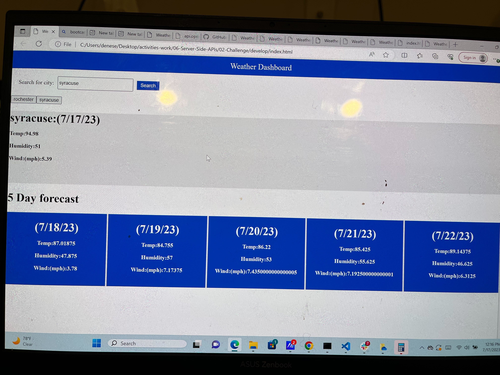

# Weather Dashboard

## Almost fully functional weather board to  display current & future forecast
This project was built with VS CODE with the intent on building a fully functional weather dashboard where the user would be able to search a city & pull up the current day's weather along with the 5 day forecast after the current day, also I have made it so the users cities searched get saved into local storage & it creates a button, unfortanatley I got stuck on this part & will need to refactor this code so that on the click of the buttons it appends the same information appended when you search a city by name.

* WHEN user searches for a city THEN user is presented with current and future conditions for that city and that city is added to the search history
* WHEN user views current weather conditions for that city,  THEN user is presented with the city name, the date, the temperature, the humidity, and the wind speed
* WHEN user views future weather conditions for that city , THEN user is presented with a 5-day forecast that displays the date, the temperature, the wind speed, and the humidity

## visual helper
start up screen

## installation instructions for users
* To install this You will first need Visual Studio Code
 * To install this you will need Git Bash, or a terminal that is convienent for your computer
## Usage
 * Step 1- you will want to create a folder using your terminal anyname works!
 * step 2- you want to create a repository to your local environment(Terminal) using command- git init
 * step 3- you will want to open up this code from your terminal onto Visual Studio Code using command- code .
 * Step 4- once VS-Code is open you will click open folder, and find the folder you named in (step #1)
 * Step 5- you will notice that the folder is empty, go ahead and create 3 new files  and rename them(index.html, script.js, and style.css) by right clicking over the untitled file, then click rename!
 * Step 6- Go ahead back to where you found my gitgub pages, and copy the index.html, and paste it into yours!
 * Step 7- Go ahead back to where you found my gitgub pages, and copy the style.css, and paste it into yours!
 * Step 8- Go ahead back to where you found my gitgub pages, and copy the script.js, and paste it into yours!

 * Step 9- From here on out this is where you can edit the code to better reflect your own touch to creativity!!
* **Urgent** on line 4 of index you will see my relative pathway for my project, your relative pathway most likely will differ, so go ahead and change it so the index.html, and style.css can work like teamates, Also on lines 31 - 36 make sure to correctly path this 
## For help
*please refer to this video for help on relative pathways- https://www.youtube.com/watch?v=hxto_sRZsBg 
 * please refer to this video for help on Creating folders & files using your terminal- https://www.youtube.com/watch?v=cllYCk-MYek

## Review

## liscense
MIT License

Copyright (c) [2023] [Tyler Henderson Webster]

Permission is hereby granted, free of charge, to any person obtaining a copy
of this software and associated documentation files (the "Software"), to deal
in the Software without restriction, including without limitation the rights
to use, copy, modify, merge, publish, distribute, sublicense, and/or sell
copies of the Software, and to permit persons to whom the Software is
furnished to do so, subject to the following conditions:

The above copyright notice and this permission notice shall be included in all
copies or substantial portions of the Software.

THE SOFTWARE IS PROVIDED "AS IS", WITHOUT WARRANTY OF ANY KIND, EXPRESS OR
IMPLIED, INCLUDING BUT NOT LIMITED TO THE WARRANTIES OF MERCHANTABILITY,
FITNESS FOR A PARTICULAR PURPOSE AND NONINFRINGEMENT. IN NO EVENT SHALL THE
AUTHORS OR COPYRIGHT HOLDERS BE LIABLE FOR ANY CLAIM, DAMAGES OR OTHER
LIABILITY, WHETHER IN AN ACTION OF CONTRACT, TORT OR OTHERWISE, ARISING FROM,
OUT OF OR IN CONNECTION WITH THE SOFTWARE OR THE USE OR OTHER DEALINGS IN THE
SOFTWARE.
© 2023 edX Boot Camps LLC. Confidential and Proprietary. All Rights Reserved.